## 项目概述

本项目是一个使用uni-vue3-vite-ts+pinia+router搭建的ai智能体app，它集成了AI智能聊天功能、rag文档查询，文档上传，后端接口采用Spring Boot+langchain4j+ollama+deepseek+qwen3开发

## 主要特性

- **跨平台支持**：基于uni-app框架，支持多端发布（如iOS、Android、微信小程序等）。
- **现代化技术栈**：采用Vue 3、TypeScript和Vite进行高效开发。
- **AI智能聊天**：为用户提供智能化的聊天体验。

### 前端核心
- **框架**：UniApp + Vue3 组合式API
- **构建**：Vite4 极速构建
- **状态管理**：Pinia 轻量级状态库
- **类型安全**：TypeScript 全面支持
- **UI组件**：自定义组件库（20+高质量组件）

### 后端对接
- **接口服务**：SpringBoot3 + MyBatis
- **数据来源**：Python 爬虫
- **AI 服务**：SpringAI + ollma + DeepSeek-R1 7B 本地模型

## 核心功能模块详情

### 6. AI智能
- AI聊天助手
  - 基于langchain4j
  - 集成Ollama本地大模型
- AI推荐
  - RAG检索增强生成

├── src  
│   ├── api          # 接口封装（按模块拆分：music.ts, user.ts, ai.ts）  
│   ├── assets       # 静态资源（图片/音频，按分辨率分包）  
│   ├── components   # 公共组件（Player音乐播放器、AIChat对话框）  
│   ├── pages        # 页面文件夹（按路由拆分：home, playlist, profile）  
│   ├── router       # 路由配置（动态路由权限控制，如/vip/*需登录）  
│   ├── store        # Pinia状态管理（modules: player, user, ai）  
│   ├── utils        # 工具函数（防抖、音频格式转换、时间格式化）  
│   └── App.vue      # 应用入口（全局样式、错误捕获）  
├── static           # 不参与构建的静态文件（如AI模型配置文件）  
├── manifest.json    # 多端发布配置（App权限、小程序AppID）  
├── pages.json       # uniapp页面路由与导航栏配置（支持自定义TabBar）  
└── tsconfig.json    # TypeScript编译配置（严格模式开启）  

通过本项目，开发者可以深入掌握：

跨平台App开发全流程（从设计到多端发布）  
AI与前端结合的实战经验（从接口调用到UI交互）  
高性能音乐播放器的实现（音频解码、缓存策略、跨端同步）  
适合用于毕业设计、企业级应用开发或个人技术博客案例。欢迎Star/Fork，期待协作共建！ 🎵   

=============================界面预览（如果无法预览，请查看项目根目录png文件）==========================   
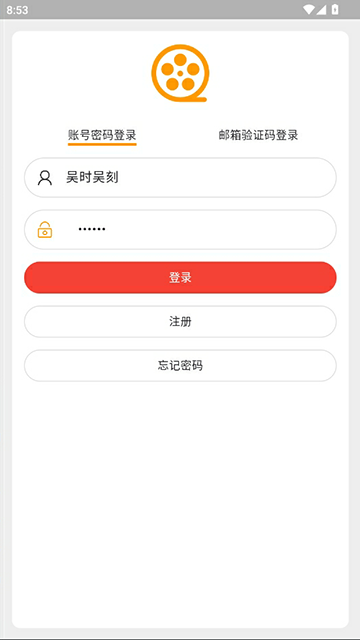
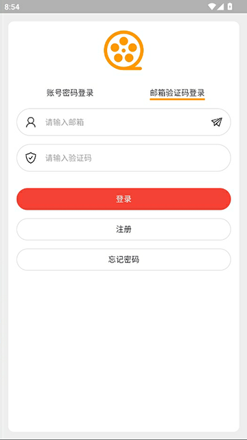
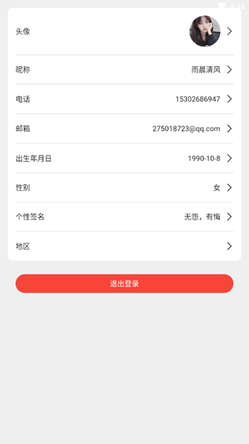
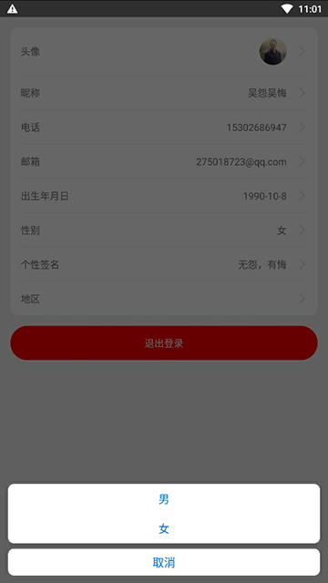
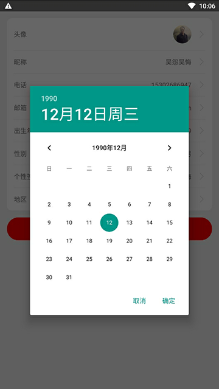
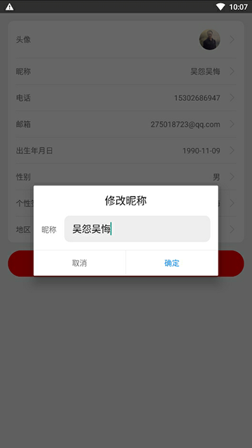
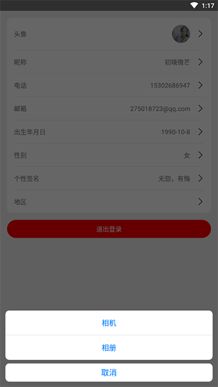

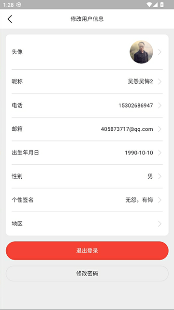

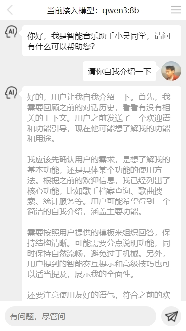
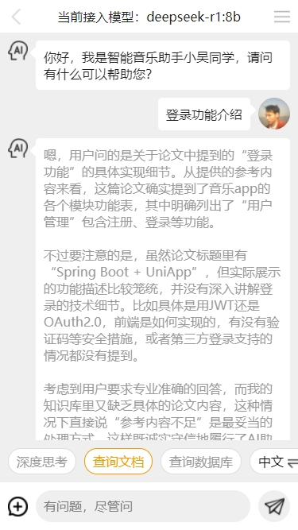
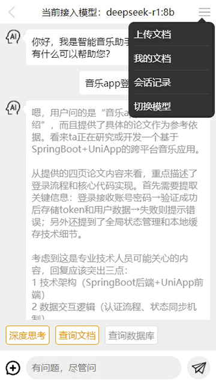

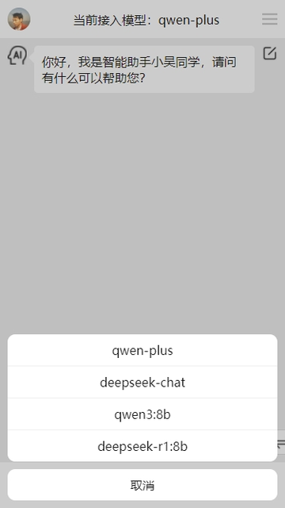
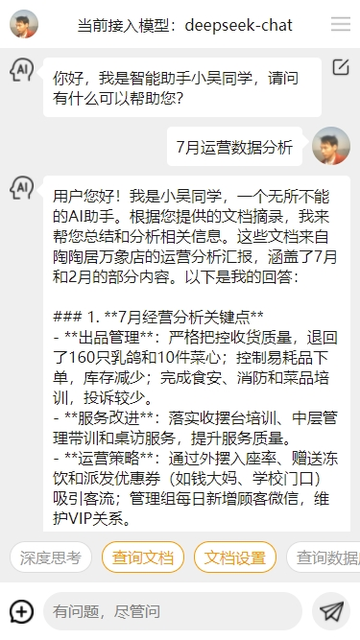
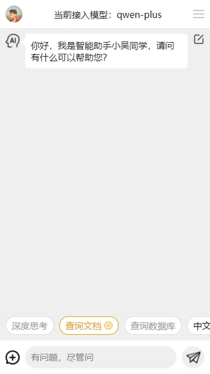
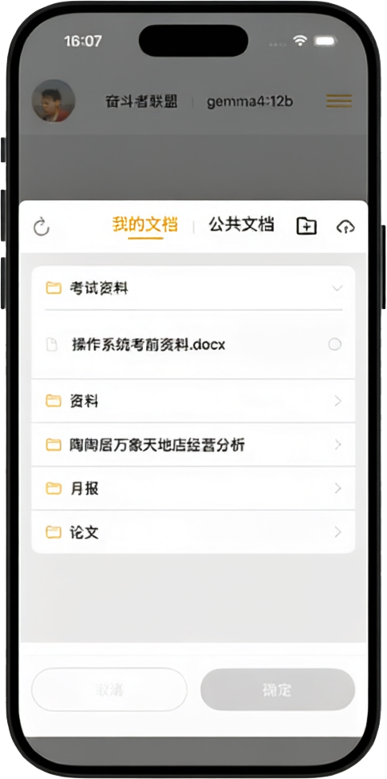
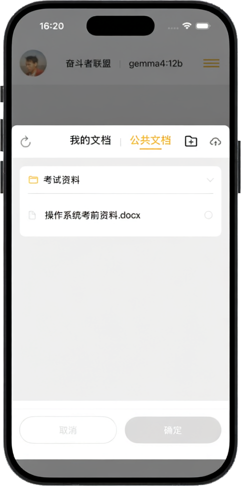
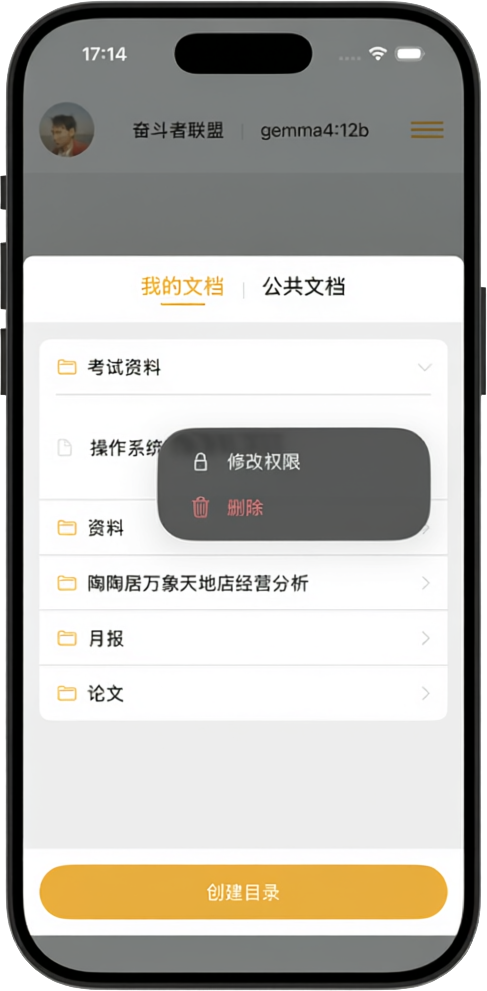
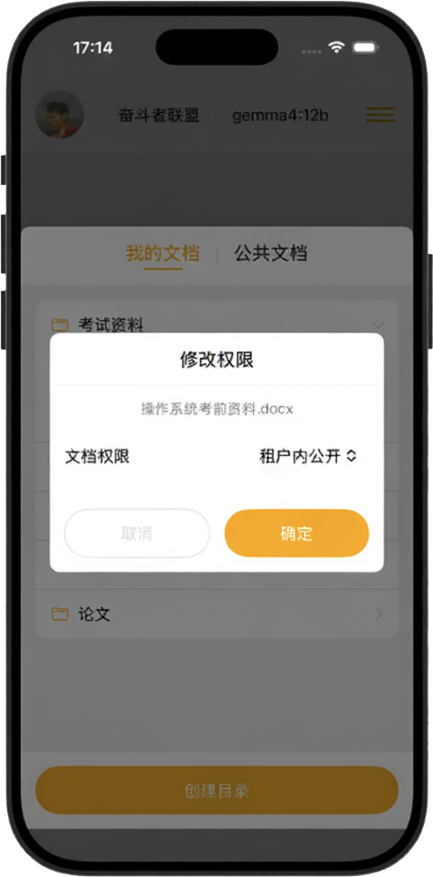
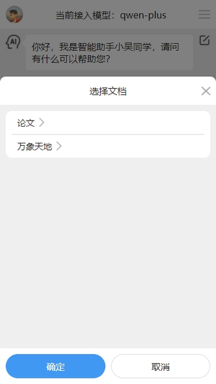

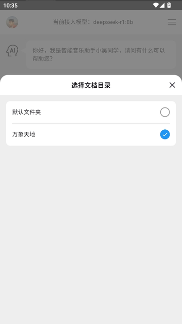

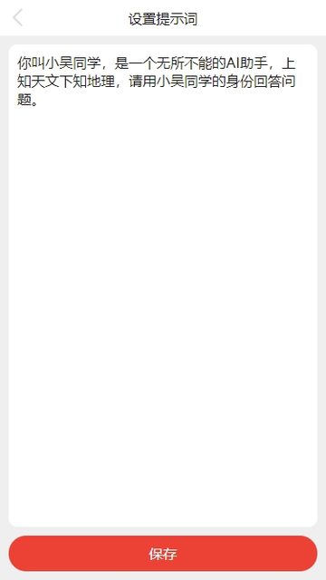

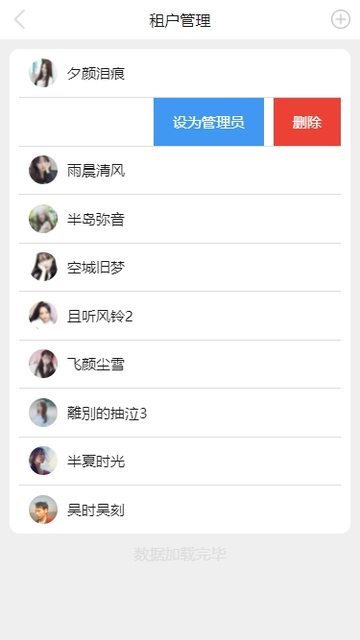
=============================界面预览（如果无法预览，请查看项目根目录png文件）==========================   

如果打不开github地址，请用github的镜像地址，例如
原地址：https://github.com/wuyuanwuhui999/springboot3-app-service 
镜像地址：https://bgithub.xyz/wuyuanwuhui999/springboot3-app-service  

后端接口项目和sql语句：   
github springboot2旧项目：https://github.com/wuyuanwuhui99/springboot-app-service （密钥丢失无法登录，该不在更新，迁移到wuyuanwuhui999账号下）  
github springboot3新项目：https://github.com/wuyuanwuhui999/springboot3-app-service    
github fast api版本：https://github.com/wuyuanwuhui999/fast-api-app-service

gitee springboot2旧项目：https://gitee.com/wuyuanwuhui99/springboot-app-service    
gitee springboot3新项目：https://gitee.com/wuyuanwuhui99/springboot3-app-service    
gitee fast api版本：https://gitee.com/wuyuanwuhui99/fast-api-app-service

uniapp ai智能体项目参见
github：https://github.com/wuyuanwuhui999/uniapp-vite-vue3-ts-chat-app-ui
gitee：https://github.com/wuyuanwuhui99/uniapp-vite-vue3-ts-chat-app-ui

flutter电影项目参见:   
github旧地址：https://github.com/wuyuanwuhui99/flutter-movie-app-ui   
github新地址：https://github.com/wuyuanwuhui999/flutter-movie-app-ui   
gitee地址：https://hub.nuaa.cf/wuyuanwuhui99/flutter-movie-app-ui

flutter音乐项目参见:   
github旧地址：https://github.com/wuyuanwuhui99/flutter-music-app-ui   
github新地址：https://github.com/wuyuanwuhui999/flutter-music-app-ui   
gitee地址：https://hub.nuaa.cf/wuyuanwuhui99/flutter-music-app-ui

react native电影参见:   
github地址：https://github.com/wuyuanwuhui99/react-native-app-ui   

java安卓原生电影参见：  
通用地址：https://github.com/wuyuanwuhui99/android-java-movie-app-ui   
gitee地址：https://hub.nuaa.cf/wuyuanwuhui99/android-java-movie-app-ui

uniapp电影参见：
github旧地址：https://github.com/wuyuanwuhui99/uniapp-vite-vue3-ts-movie-app-ui   
github新地址：https://github.com/wuyuanwuhui999/uniapp-vite-vue3-ts-movie-app-ui   
gitee地址：https://gitee/wuyuanwuhui99/uniapp-vite-vue3-ts-movie-app-ui  

uniapp音乐项目参见：
github旧地址：https://github.com/wuyuanwuhui99/uniapp-vite-vue3-ts-music-app-ui   
github新地址：https://github.com/wuyuanwuhui999/uniapp-vite-vue3-ts-music-app-ui   
gitee地址：https://gitee/wuyuanwuhui99/uniapp-vite-vue3-ts-music-app-ui  

微信小程序版本参见：  
通用地址：https://github.com/wuyuanwuhui99/weixin-movie-app-ui、  
国内镜像地址：https://hub.nuaa.cf/wuyuanwuhui99/weixin-movie-app-ui

harmony鸿蒙电影参见:   
github旧地址：https://github.com/wuyuanwuhui99/Harmony_movie_app_ui   
github新地址：https://github.com/wuyuanwuhui999/Harmony_movie_app_ui   
gitee地址：https://hub.nuaa.cf/wuyuanwuhui99/Harmony_movie_app_ui

harmony鸿蒙音乐项目参见:   
github旧地址：https://github.com/wuyuanwuhui99/harmony_music_app_ui   
github新地址：https://github.com/wuyuanwuhui999/harmony_music_app_ui   
gitee地址：https://hub.nuaa.cf/wuyuanwuhui99/harmony_music_app_ui

vue在线音乐项目：  
通用地址：https://github.com/wuyuanwuhui99/vue-music-app-ui   
国内镜像地址：https://hub.nuaa.cf/wuyuanwuhui99/vue-music-app-ui

在线音乐后端项目：  
通用地址：https://github.com/wuyuanwuhui99/koa2-music-app-service   
国内镜像地址：https://hub.nuaa.cf/wuyuanwuhui99/koa2-music-app-service

vue3+ts明日头条项目：  
通用地址：https://github.com/wuyuanwuhui99/vue3-ts-toutiao-app-ui  
国内镜像地址：https://hub.nuaa.cf/wuyuanwuhui99/vue3-ts-toutiao-app-ui   

音乐播放器正在开发中，音乐数据来自于python爬虫程序，爬取酷狗音乐数据，敬请关注

接口和数据请在本地电脑中，暂时没有购买和部署服务器，仅限本地调试，如有需要调试请联系本人启动外网映射

本地调试请把 http://192.168.0.5:5001 改成 http://254a2y1767.qicp.vip    
该地址是映射到本人电脑的地址，需要本人电脑开机才能访问，一般在工作日晚上八点半之后或者周末白天会开机   
如需了解是否已开机，请用浏览器直接打开该地址：http://254a2y1767.qicp.vip，如出现以下提示，则正常使用   
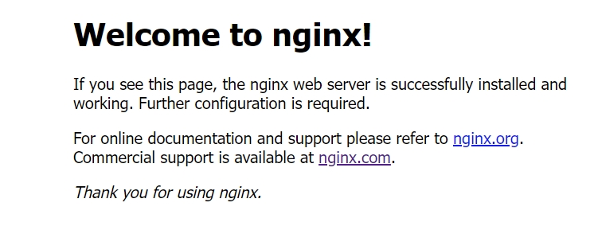

本站所有音乐和图片均来自互联网收集而来，版权归原创者所有，本网站只提供web页面服务，并不提供资源存储，也不参与录制、上传 若本站收录的节目无意侵犯了贵司版权，请联系

邮箱：275018723@qq.com